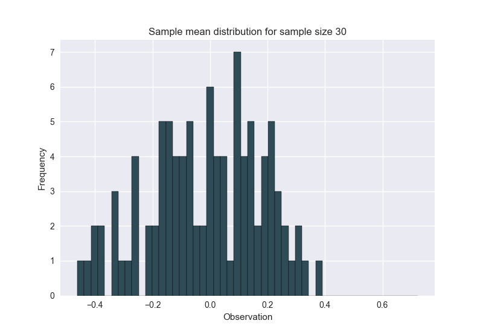

# Central Limit Theorem Demo

In probability theory, [the central limit theorem (CLT)](https://en.wikipedia.org/wiki/Central_limit_theorem) establishes that, in most situations, when independent random variables are added, their properly normalized sum tends toward a normal distribution even if the original variables themselves are not normally distributed.

# Requirements

[numpy](http://www.numpy.org/), [matplotlib](http://matplotlib.org), and [seaborn](https://seaborn.pydata.org) are required.

# Usage

```python
import clt_demo as clt

# CLT works for any distribution, we use standard t distribution for illustration
distr = np.random.standard_t(10, size=10000)
clt.plot_distribution(distr, "Population distribution", num_bins = 50)
# sample_size --> infinity
sample_sizes = [3, 5, 10, 15, 20, 30]
demo = clt.CLTDemo(distr)
for n in sample_sizes:
	demo.run_demo(n)
```

The code above produces the following graphs.


